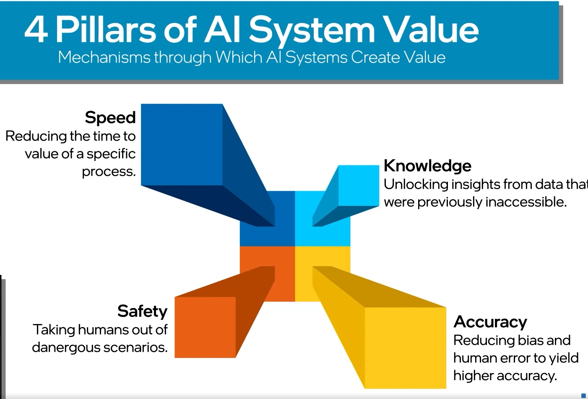
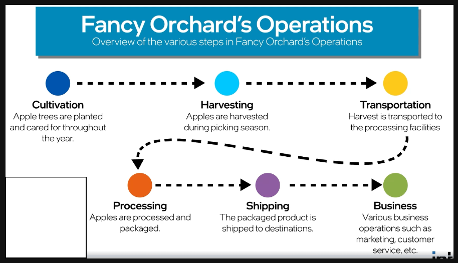
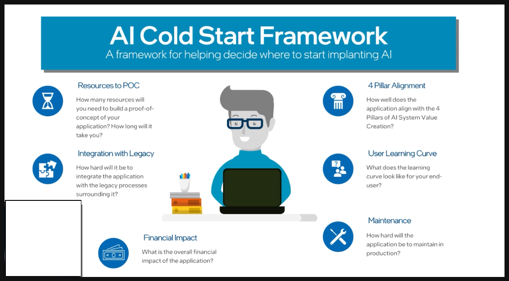
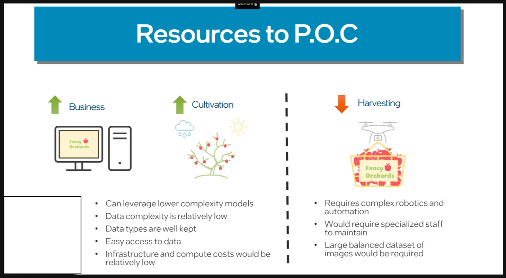
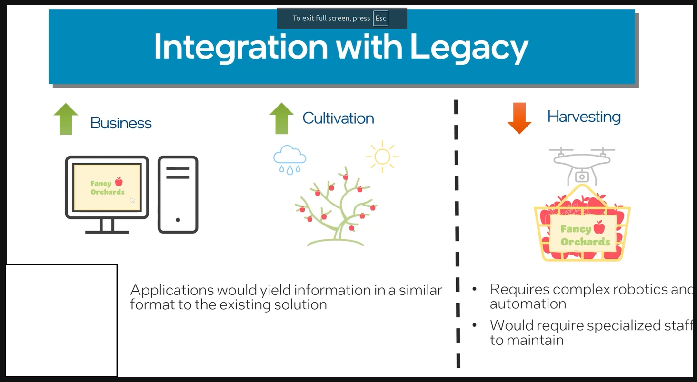
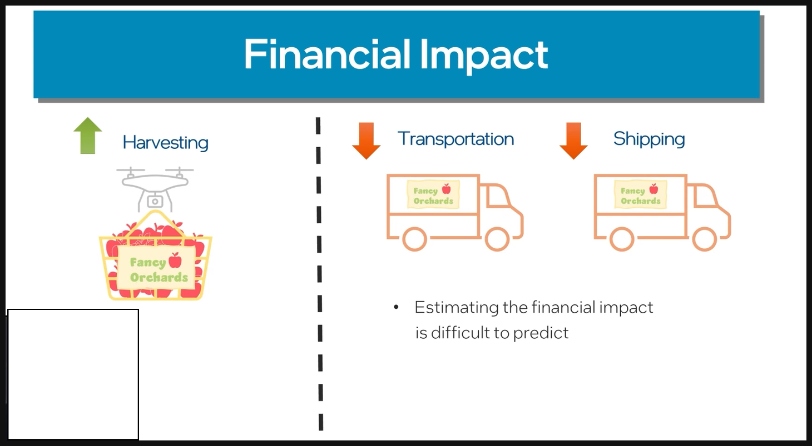
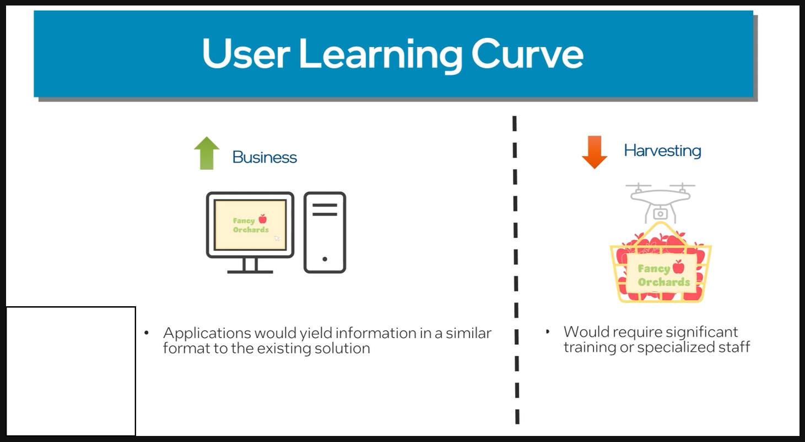
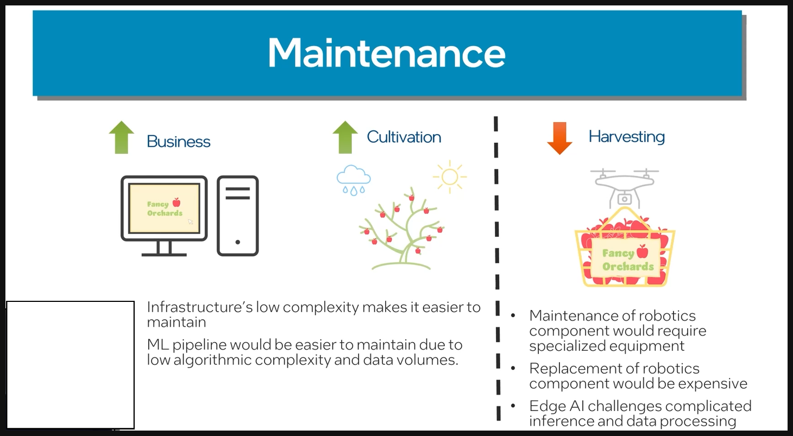

#### Value Driven Design in AI Solutions

- End Goal - Understanding how AI can understand and optimize operations of legacy systems

- AI systems are built of fundamental understanding that algorithms can extract information from data to form a comprehensive understanding of the system described by that data.

**Benifits of AI Systems:**

---
**Using AI into legacu operations :**

---
1. Cultivation :

- Using weather historical patterns to decide amount of water and fertilizer usage

2. Harvesting :
- Using drons and computer vision to determine harvesting condtions to improve product quality

3. Transportation :
- Using graph neural networks to optimize the pickup and drop off times for faster delivery

4. Processing :
- Using computer vision to improve product quality and removal of bad apples

5. Shipping :
- Using Graph neural networks to optimize the shipping routes to reduce cost 

6. Business :
- Using business intelligence applications to predict demand based on historical data
---
**AI Framework :**

Business is real winner here because it scores highest due to it's impact.

