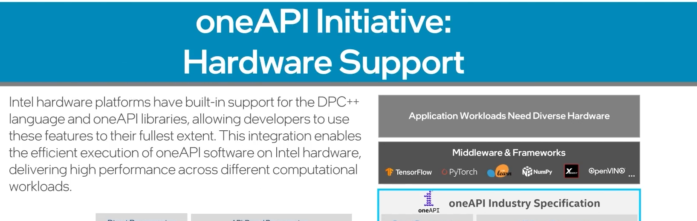

## Value Driven Design in AI Solutions

- End Goal - Understanding how AI can understand and optimize operations of legacy systems

- AI systems are built of fundamental understanding that algorithms can extract information from data to form a comprehensive understanding of the system described by that data.
---
**Benifits of AI Systems:**

---
**Using AI into legacy operations :**

---
1. Cultivation :

- Using weather historical patterns to decide amount of water and fertilizer usage

2. Harvesting :
- Using drons and computer vision to determine harvesting condtions to improve product quality

3. Transportation :
- Using graph neural networks to optimize the pickup and drop off times for faster delivery

4. Processing :
- Using computer vision to improve product quality and removal of bad apples

5. Shipping :
- Using Graph neural networks to optimize the shipping routes to reduce cost 

6. Business :
- Using business intelligence applications to predict demand based on historical data
---
**AI Framework :**

Business is real winner here because it scores highest due to it's impact.

---
## Components / essentials of Traditional AI Solutions

A. ML Pipeline

B. Compute Infrastructure

C. User Interface

---

### **A. ML Pipeline - consists of**

#### 1. Data processing :
- Preparing and transforming raw data from machine learning 
- 
- Tool used for data processing 
    - **Apache Spark** (used for big data processing)
    - **Pandas** (provides robust structure for efficient data manipulation and pre-processing)
    - **Apache Kafka** (distributed real time platform for real time data ingestion and processing, ensuring seamless data streaming for ML pipelines)

    - Data involved significantly impact performance and effectiveness of machine learning model
    -    Data processing steps :
        
         - **Collections** - gathering data through databases, API, files or scraping data from web 
         - **Data cleaning and pre-processing** :
                 
            - cleaning involves identifying data inconsistencies, errors and missing values in the data 
            - pre-processing involves formatting the data to make it suitable for model training. This helps in eliminating biaes, standardizing features and reduce the dimensionality of the data
    - **Feature engineering** - creating new features to capture relative patters and relationships between data    
 
---
#### 2. Model Development :
- Using processed datasets to train machine learning models
- 
- Data scientists design and build predictive models based on processed data
- Stage involves choosing right model architecture, training the model using labeled data and evaluating its performance
- **Algorithmic selection** :
    - choosing the right architecture or algorithm that aligs the best with problem. Depends on data type and nature of the problem
    - commonly used algorithms are Linear regression, decision trees, random forest and support vector machines and neural networks
- **Training** :
    - training model using labeled data (training set)
    - model learns to find patterns and relationships with data by adjusting the parameters through optimization process 
    - Involves minimizing errors and losses such as mean square method or cross entropy
- **Validaiton** :
    - To check the performance of the model using evaluations matrics and validation data
    - validation data is used to assess the models generalization ability and detect the overfitting
    - Techniques such as cross validation and holdout validation are commenly employed during this process
    - Iterative refinement is neccessary in model development by adjusting hyper parameters such as learning rate,regularization strength and network architecture
    - Model performance issues are due to training datsets

    - Popular model development frameworks : pyTorch, TensorFlow and scikit learn 
    - For GenAI - include hugging face training and fine tuning API 

---
#### 3. Inference - Using trained models to make predictions or generate assets on unseen data
- 
- Goal of inference is use trained models predictive powers to make accurate and reliable predictions on new data points
- In this stage new data is provided to the model and model applies to learn patterns and relationships to generate predictions
- 
1.  **Real time inference** - Data is generated on the fly 
    - most important like low latency 
2. **Batch inference** - predictions are calculated on batch data points
    - predictions are made in more flexible manner 

- **Model deployment** : can be deployed on
    - Local servers 
    - In the clouds
    - On the Edge
    - depending on the specifications of the application

- Deployment environment should be optimized for scalability, realiability to handle incoming data and produce predictions
- Techniques like model optimization, containization and distributed systems are employed to ensure scalable and efficient inference process
- 
- Continuous monitoring allows for model updates and refinements
- when in production inference processes impact performance
---
#### Compute Infrastructure
- Provies necessary resources for data processing, model development and inference
- Contains hardware and software that enables efficient and scalable computation
- 
- This includes servers, clusters and cloud platforms that hosts the data processing and model development stages.
- Developers should access the specific needs of the application and build backwards to define the most suitable compute stack 
- 

---
#### Heterogenous AI Systems
- They allow for the allocation of most specific task to the most suitable compute resources, maximizing the performance and enabling scalability of the AI systems
- carefully define the requirements

- 

---
#### UI 
- provide means for users to interact with the AI system
- 
- 
- Inputs could be audio, video, images. System should support various data formats
- Result interpretation : output should be clear and understandable - ease of decision making 
- 
- System control:
- 

- API : API enables integration with other applications, data sources and platforms

---
#### Summary
- 

---

## Bottlenecks and Opportunities for Optimization in AI Systems

- relaving performance issues in AI systems and boosts
- 
- Bottlenecks affect performance of AI systems
- 
- Performace Bottleneck : compute
    - Arises when tasks involves complex calculations, large scale data processing  or training deep learning models 
    - 

- Performace Bottleneck : memory
    - 
    - consider efficient data structures and employing memory saving techniques like data compression or sparcity  

- Performace Bottleneck : IO
    - When system rely on real time or streaming data, high IO latency can introduce delays in processing and decision making
    -     
    - Solution : optimizing data pipelines, leveraging high speed storage or network interfaces and employing caching mechanism can help reduce IO latency and improve performance
    - e.g. 

- Optimizing software is more favourable than hardware in this case as this is more feasible

- Techniques such as the algorithm optimization, parallel processing and distributed computation are crutial 
- 
- The normal operations that we do are scalar computation meaning iteration of array but on the other hand vectorization enables you to perform the operation on all elements all at once. This is efficient approach when dealing with large amounts of data 
- 
- parallel processing speeds up tasks like model training, inference or data processing by dividing the workload across multiple processing units therefore reducing overall processing time.
- 
- 
- 

#### software hardware co-design
- 
- optimization of software to take advantage of hardware 
- Leads to improved performance by optimizing algorithms and architecture to leverage strength of hardware
- Tensorflow and pyTorch offers CPU and GPU acceleratorated operations and optimized neural network layers while libraries like oneDNN and cuDNN provide hardware optimization tools 
- These libraries and frameworks take care of hardware complexity and allow developers to focus on algorithmic design

---
#### ONEAPI
---
- 
- 
- 
- 
