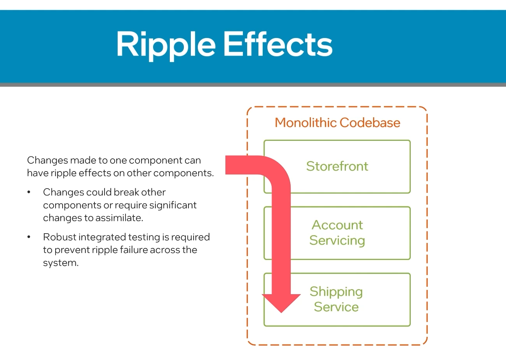
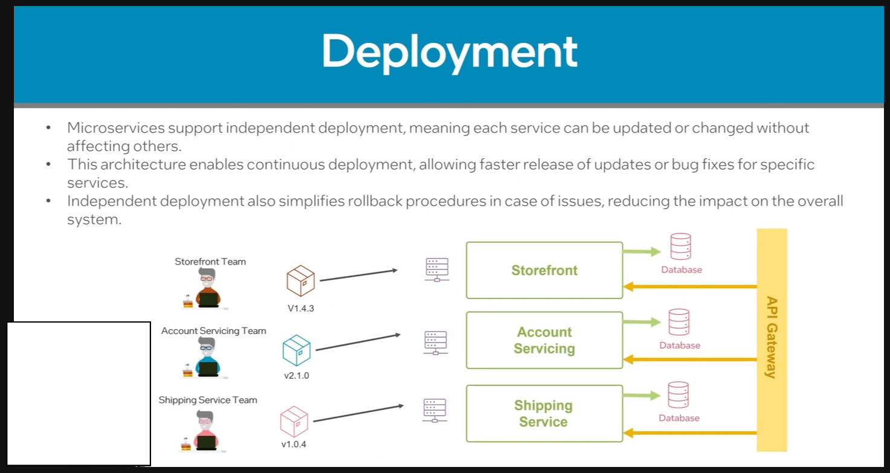
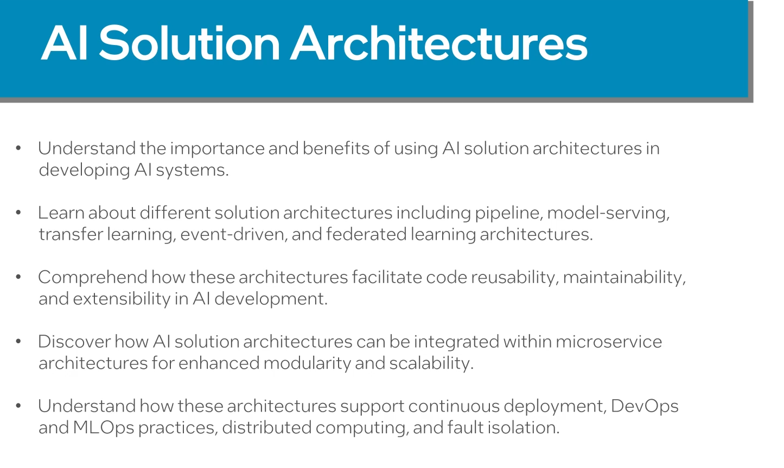

## Introduction to Software Solution Architectures

- Enable developers make informed decisions about the systems overall design like technology, components and frameworks
- 
- 
- Arch style defines the systems overall structure, organization and communication pattern

---

#### Monolithic Architecture
- single tightly coupled unit
- All functionality required are within the single codebase
---
#### Microservices Architecture
- small independent services. Each service focuses on specific business capability
---
#### Service Oriented Architecture
- loosly coupled services. Each service are self contained and communicate with each other 
- These services communicate with each other through web services or APIs

---
#### Event driven Architecture
- system responds to events and messages. events respresent to changes in the state of the application
- Components reacts to these events and messages asynchronously
---
#### Comparison of Architecture
- When selecting a architecture style for a software solution consider scalability, maintainability, performance, integration needs 
- 
- Microservices architecture and Event driven architecture are inherently designed for scalability
- Performance is critical aspect when selecting an architecture
- For instance, monolithic architecture fast response time due to absence of network communication overhead.
- In constract, microservices  architecture allow for distributed scaling and performance optimizations at the service level
- 
---
#### Summary
- 
-  Monolithic Architectures while offering simplicity and quick response can struggle with scalability
-  Microservices offers scalabilty and flexibility but brings complexity when it comes to system management
---
## Monolithic Solution Architectures
- Entire application is build as single, self contained unit
- 
- All components are tightly coupled and contained within single codebase
- Application run on single server or cluster of servers
- 
- 
- Hard to modify one part of the application without affecting other components
- Systems are centralized
-  
-   
- Introduces limitations in terms of scalability
-  
- 
- 

---
## Microservice Solution Architectures
- Building a solution as small independent services. Each service focuses on specific business capability as separate self contained unit
- 
- 
- Chance in once service does not affect other services - Helps team follow agile framework
- Adventage : Independent Scaling 
-  
- 
- Changes or updates in a one service can be affected without affecting other 
- Easier rollback | Asychronous deployment 
- 
- Suitable for large scale application 

#### Design Principle
- 
- 
- 
-  
- 
- Service Autonomy - Each service has it's own codebase, database and deployment strategy. This allows each service to scale autonomosly
- Bounded context - boundries of each service is clearly defined 
- Decentralized Governance - Each team had independent decisions to make about their microservice
- Desing patterns - Service discovery - to communicate with each other dynmically | Circuit bracker - to handle failures and prevent them from propogating thoughout system. In case of failure the traffic is divered to fall back service | API GateWay - acts a central entrypoint for clients, abstracting complexities of service
- Improved scalability and flexibility
- 

---
## AI Solution Architectures
- 
- 
---

#### Pipeline Solution Architecture
- 

- 

- 

-  

- 

- 