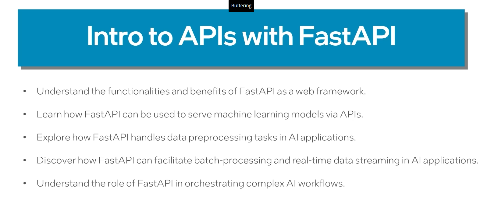

## API Planning and Architecture​s

- 
-  
-  
- 
- 
- 

#### Fundamental principles of REST API 
- 
- 
-  
-  
- 

#### Summary:
- 

---
## HTTP Protocols and Server Requests

-  
- 
- 
- GET - Retrieves the data from the server
- POST - post the data to the server
- PUT 
- 
- 
- 

---
## Introduction to APIs with FastAPI :
- 
- 
-  
- 
- 
- 
#### Summary:
- 

---
## Building FASTAPI Lab1:
- conda.yaml - contains all the requirements
- Serve.py - script that launches and support various API endpoints
- docker file works to build image 
- maintainace.py - test file that tests the funcationality of API 

---
- **Problem Statement:** - You have been recruited to Fancy Orchards' new AI Engineering team. Your first assignment is to build a predictive maintenance tool that uses machine learning to determine when an automated apple harvester needs to be serviced. The desired outcome is reducing the frequency of severe damage to equipment.

Before starting, you want to establish some of the application's logic by building simple API endpoints. These endpoints are not connected to any machine-learning functionality at this point.
- **Step-by-step Instructions for the Lab:**
- Environment Setup
    - Connect to your Intel® Tiber™ AI Cloud session through the Visual Studio Code application.
    - If you have not done so, clone the course code repository.
    - Navigate to the lab1 directory.
    - The code for this lab is in the sample folder.
    - Use the conda.yml file to build your conda environment to run the sample. Run:
    - **conda env create -f conda.yml**

    - Run the following to activate the environment:
    - **conda activate lab1**
- Running the Sample: 
  - Navigate to the sample folder and run the following in the command line:

  - Open another terminal. In the new terminal, use curl to interact with the endpoint:

- You can also try deploying it with docker.
  - To build the docker image, run:

- Once the image is finished building, run:

- Use the same curl command from step 2.c to interact with the application inside the container.
- Add functionality to the maintenance endpoint: Adjust the maintenance endpoint to flag for maintenance if the hydraulic pressure exceeds 2000 psi.
- Add a new endpoint: Add an endpoint called supportbot that returns a hard-coded response of "bring the harvester in for maintenance" when prompted with the text string "help.”
(Optional) Containerize the application: Package the API into a Docker container.
Repeat step 2.d instructions with your version of this lab’s endpoint.
Challenge Questions:
How does FastAPI handle request routing and route parameterization?
Explain the benefits of using asynchronous programming in FastAPI for handling API requests.
How can you deploy the FastAPI-based API to a production environment for serving real traffic?
 

Challenge Question Answers:
- FastAPI defines API endpoints and associated functions using Python decorators. Route parameters can be specified using curly braces in the URL pattern (e.g., /items/{item_id}), and their values are extracted as arguments to the endpoint function.
- Asynchronous programming in FastAPI allows the server to handle multiple requests simultaneously, making the API more responsive and efficient. This is especially useful for applications with I/O-bound operations, such as waiting for external services or databases.
- To deploy a FastAPI-based API in production, you can use a web server like uvicorn or gunicorn behind a reverse proxy like NGINX. Additionally, you should consider containerizing the application with Docker to ensure consistency and ease of deployment.

- 