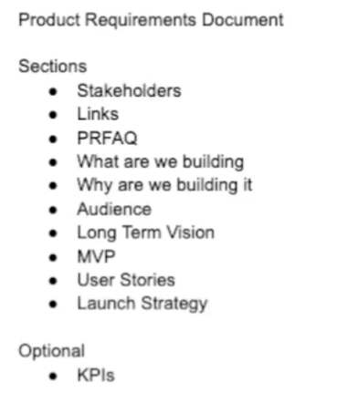

**E1: Project Ideation And Motivation**
---------------------------------------------------------------------------
- A strong why leads to strong results, a weak why leads to weak results
- Plan twice, implement once 
- Why -> Idea -> Design -> Build -> Live
-  Build something that you are passionate about 
- Solve a problem that you've faced yourself

Passion and Problems.

 Why you are building this project?
	- Reason
	- Target audience 

What do i want to build and learn ?
	-

-------
###### Getting started in always hard.

- Have personal attachment with your project and ideas
- Project name 
	- Problem - I need a way to track my workouts 
	- Idea - Build an app that tracks your workout routines and suggests exercises

Competitors -- Model of operation

Learn a concept -- code out that concept -- Deploy on web-app for interaction

Understand the pain points and offer a solution to that pain point
Process and iteration 

-----------------------------------------------------------------------

E2 : Product Requirements Document
----------------------------------------------------------------------------------
- PRD will contain - who, what, where and how of product
- 
	- 
- User Stories - As a user I want to (do this) so that I can (do this)
----
- Introduction 
	- This project intends to accomplish this.
- Objectives
	- End goal of this project is to.
- PRFAQ - End goal of the project to get traction -- Press release (this is used by to
	
	- 
	- 
- Scope
	- Ability for user to upload media 
	- Transform media 
	- View TM 
	- Download TM
- User stories 
	- As a user, I want to upload media so that i can apply visual computing techniques on it
- Non function requirements
	- Automatic deletion 
	- security 
	- rate limit 
	- prevent upload over xx GB
- KPI - Key performance indicators
	- Number of uploads 
	- Number of downloads 
	- Number of page visits
- Mock ups 
- Tech Design 
- Dev Timeline 
- Launch / Marketing Strategy
---
E3 : Tech Stack
----------------------------------------------------------------------------------

Vercel 
- PAAS deploy application for you 
AWS 
- Cloud provider 
- S3 - To store the images and videos
- Lambda - to perform visual computing concepts 
- RDS - serves as a database to deploy a PostgreSQL instance
Back-end 
- PostgreSQL
Iaac
- Terra-form code (cloud agnostic)
---
E4 : Creating The System Design For my Web App: S3, Lambda, Polling
------------------------------------------------------------------------

