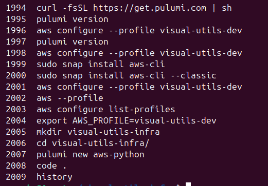

**E1: Project Ideation And Motivation**
---------------------------------------------------------------------------
- A strong why leads to strong results, a weak why leads to weak results
- Plan twice, implement once 
- Why -> Idea -> Design -> Build -> Live
-  Build something that you are passionate about 
- Solve a problem that you've faced yourself

Passion and Problems.

 Why you are building this project?
	- Reason
	- Target audience 

What do i want to build and learn ?
	-

-------
###### Getting started in always hard.

- Have personal attachment with your project and ideas
- Project name 
	- Problem - I need a way to track my workouts 
	- Idea - Build an app that tracks your workout routines and suggests exercises

Competitors -- Model of operation

Learn a concept -- code out that concept -- Deploy on web-app for interaction

Understand the pain points and offer a solution to that pain point
Process and iteration 

-----------------------------------------------------------------------

E2 : Product Requirements Document
----------------------------------------------------------------------------------
- PRD will contain - who, what, where and how of product
- 
	- 
- User Stories - As a user I want to (do this) so that I can (do this)
----
- Introduction 
	- This project intends to accomplish this.
- Objectives
	- End goal of this project is to.
- PRFAQ - End goal of the project to get traction -- Press release (this is used by to
	
	- 
	- 
- Scope
	- Ability for user to upload media 
	- Transform media 
	- View TM 
	- Download TM
- User stories 
	- As a user, I want to upload media so that i can apply visual computing techniques on it
- Non function requirements
	- Automatic deletion 
	- security 
	- rate limit 
	- prevent upload over xx GB
- KPI - Key performance indicators
	- Number of uploads 
	- Number of downloads 
	- Number of page visits
- Mock ups 
- Tech Design 
- Dev Timeline 
- Launch / Marketing Strategy
---
E3 : Tech Stack
----------------------------------------------------------------------------------

Vercel 
- PAAS deploy application for you 
AWS 
- Cloud provider 
- S3 - To store the images and videos
- Lambda - to perform visual computing concepts 
- RDS - serves as a database to deploy a PostgreSQL instance
Back-end 
- PostgreSQL
Iaac
- Terra-form code (cloud agnostic)
---
E4 : Creating The System Design For my Web App: S3, Lambda, Polling
------------------------------------------------------------------------
- System Design will be the technical solution to the webapp we are building 
- Make sure to understand all the requirements and user stories
- Understand the user flow and user steps to create a great solution and then backtrack to understand technical steps 

- 

- High Level - System Design | progress bar depends on s3 and lamda communication

- 

- S3 event source will trigger the lamda. Every time a new image is added to S3, a corresponding lamda will be called
- In our case, whenever a image is added to S3, we can do RGB splitting for our lambda and put it back to our S3 bucket.
- S3 has public and private bucket. If it's a public bucket then anyone can see it. To avoid this we need a presigned url. So what it does is you can only access the bucket through my NextJS application. you need to go through my NextJS application to access the S3 bucket
- Presigned url allows browsers to upload image to S3 bucket - browsers will make a POST request to S3 bucket
- Technical - System Design
- 
- Image upload workflow - System Design
- 

- Image download workflow - System Design
- 

- Polling workflow - System Design (Progress bar) Image uuid as object key
- 

- RGB Spliting workflow - System Design
- 

---
E5 : How To Create A Tech Design Doc
------------------------------------------------------------------------

- Overview (linked with PRD)

- Define how you are going to satisfy the user stories 

System Design - High level overview
- 
- 

- 

- 

- 

S3 Notifications / trigger :
- we then want to take the RGB splitted file and upload it back to S3
- Whenever you upload a image onto, you can make it so lambda will be invoked on that object that you've jus uploaded

- https://docs.aws.amazon.com/lambda/latest/dg/with-s3-example.html

- There is chance of infinite loop over processed images with single s3 useage to we decided to create 2 different s3 buckets, one for imput image and one for processed output image

- 

User downlaod :
- 

Polling 

- 

- HeadObject - if it returns a metadata then it means it exists in s3

- 

- https://docs.aws.amazon.com/AmazonS3/latest/API/API_HeadObject.html

API 
- 

Milestone / Dev task 
- 
- 
- 

---
E6 : Hello World! Deploying My Next.JS App On Vercel
------------------------------------------------------------------------

- Overview (linked with PRD)

- Define how you are going to satisfy the user stories 

System Design - High level overview
- 
- 

- 

- 

- 

S3 Notifications / trigger :
- we then want to take the RGB splitted file and upload it back to S3
- Whenever you upload a image onto, you can make it so lambda will be invoked on that object that you've jus uploaded

- https://docs.aws.amazon.com/lambda/latest/dg/with-s3-example.html

- There is chance of infinite loop over processed images with single s3 useage to we decided to create 2 different s3 buckets, one for imput image and one for processed output image

- 

User downlaod :
- 

Polling 

- 

- HeadObject - if it returns a metadata then it means it exists in s3

- 

- https://docs.aws.amazon.com/AmazonS3/latest/API/API_HeadObject.html

API 
- 

Milestone / Dev task 
- 
- 
- 

---
E7 : Hello World! Deploying My Next.JS App On Vercel
------------------------------------------------------------------------

- Create a repo on Github
- initialize a next js app
- https://nextjs.org/docs/app/getting-started/installation

- npx create-next-app@latest

- npm run dev -- to locally run the next js app

- attach github repository to vecel - create a deployment and webapp will be deployed and live

---
E7 : Creating A File Uploader Component
------------------------------------------------------------------------

- Step 1 of the workflow to allows user to upload a image 
- UI Library - https://ui.shadcn.com/
- accept="image/*" -> accept only images
- the way next js works and SSR work is that when you go onto homepage page.tsx it's gping to render all the html that it'll need on the server side
- Any interaction with the client side you need to label it as client side as -> "use client";
- FileUploader is returning a react component
- input for this is choose file - if the file exists then its goona create a file reader - once done set state on image 

- Alert on file size -> UI component from shadcn -- if file size is too big then render an alert on the UI 
	- State to determine if file size too big

- AssetType - defines what you are uploading onto the browser | all asset types have different types of asset configs

---
E8 : How To Create An AWS Account
------------------------------------------------------------------------
- 
- Root Account - use at least as possible - All permissions
  - 
- Admin user - sub section of admin user and root can remove admin in case of leaks 
  - 
- Dev user - principal of least usage
  - 
- 

--- 
E9 : Infrastructure As Code (IaaC) Explained: Pulumi And S3 
------------------------------------------------------------------------
- Introduction : 
- 
- Software is a house. Infrastructure is a foundation that you need to keep house warn.
- Creation of S3 Bucket - go to search bar - s3 - create bucket
- pulumi - as a IaaC software. What it does is gets to AWS and does action on behalf of you 
- 